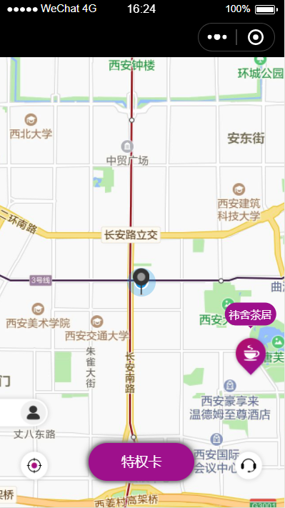

# 周边有插件说明文档

## 1.目前周边有插件信息
AppID ：wx8f07aa7235446b21
版本号：1.0.1

## 2.具体使用方法

### 2.1、修改配置文件JSON
{
  "usingComponents": {
    "myMap": "plugin://myPlugin/map"
  }
}

### 2.2、在页面的WXML文件中添加标签
<myMap initData='{{data}}'/>

### 2.3、JS文件中处理传入插件数据，数据包括：姓名、商家的经纬度、小程序官方电话、小程序ID、vip背景图、个人图像、用户Token，数据信息，封装在data结构中
var plugin = requirePlugin("myPlugin")
Page({
  data:{
    data:{
      name: '小王',   //姓名 必填
      longitude: '108.94882',   //经度 必填
      latitude: '34.222571',   //纬度 必填
      catalog: '2',   //小程序ID 必填
      phone: '134****4686',   //电话 必填
      vipBj: 'https://test.wangtang.com.cn/hormone/dist/img/b1.png',   //vip背景图 必填
      cardLogo: 'https://test.wangtang.com.cn/hormone/dist/img/vip.png',   //个人图像 必填
      userToken: 'eyJhbGciOiJIUzUxMiIsInppcCI6IkdaSVAifQ.H4sIAAAAAAAAAKtWKi5NUrJSMjQyMlaqBQCgpJuvDgAAAA.1C3i0BlNbcAlGtm4koDVdT6iCjih7i2PAhkOR8UiScsung4K-2wW8aTSgwHHsaMXZBgTJIs0oqoVJgvHdI8DBg'   //用户Token 必填
    }
  },
  onLoad: function() {
    plugin.getData()
  }
})

## 3.效果图
